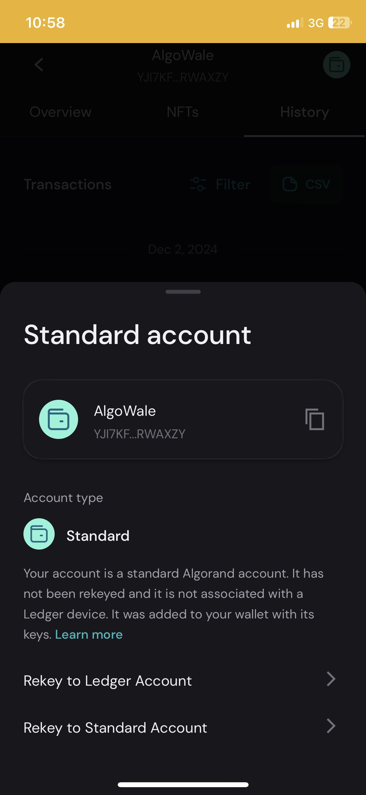
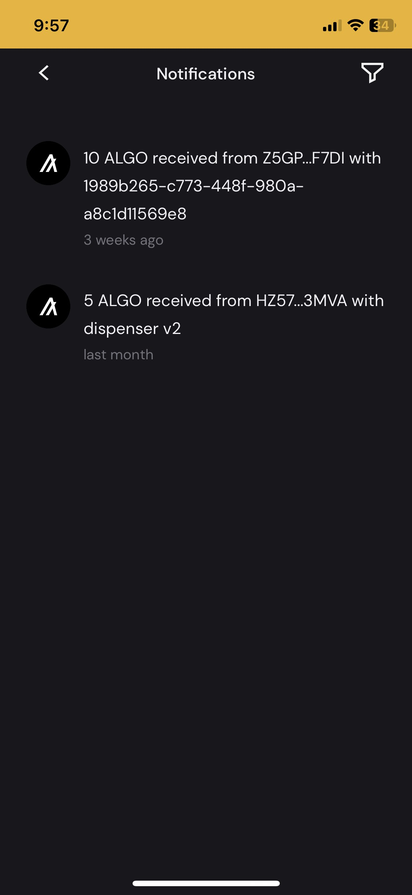
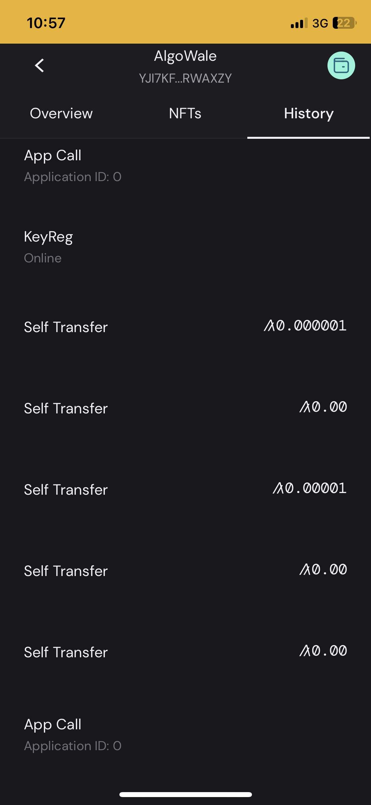
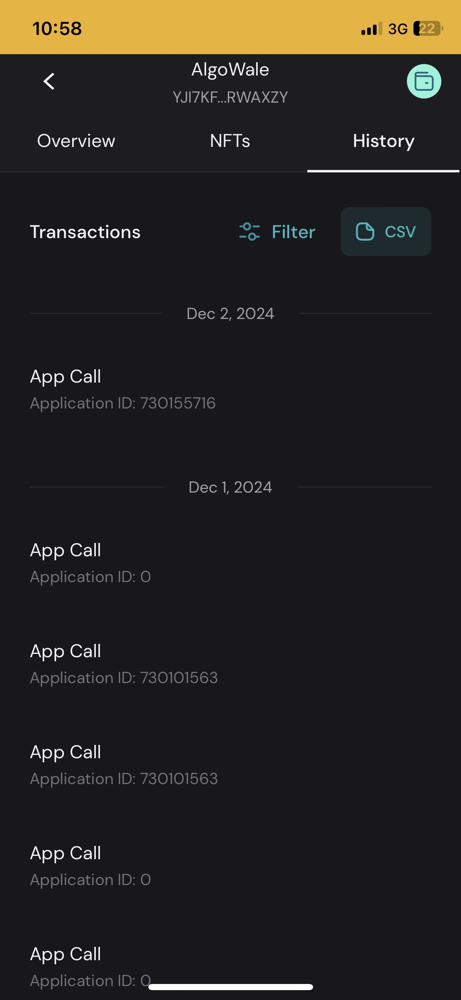

# pay-rent-ng-contracts

This project has been generated using AlgoKit. 

# Demo 

Demonstration of functionalities running locally on the Testnet using Pera Wallet.

1. **Activate Virtual Environment**: Initialize the virtual environment using the command:  ```poetry shell```

2. **Launch Lora the Explorer**:  Open Lora the Explorer with the following command:  `algokit explore`

3. **Build Smart Contracts**: Build the contracts by executing: ` poetry run python -m smart_contracts build`

4. **Deploy Generated Artifacts to Lora**: Open Lora the Explorer.
   -  Connect your Pera Wallet:
   -  Select Testnet (not Localnet).
   -  Click Connect Pera Wallet.
   -  On your mobile device, scan the Pera QR code displayed on Lora the Explorer.
   -  🎉 Success: Your smart contract is now deployed to the Algorand blockchain network.

5. **Test Deployed Smart Contract Using FastAPI on Postman**: 
   -  Start FastAPI Server
      Run the FastAPI server with the following command: `uvicorn smart_contracts._helpers.api:app --reload`
   - API Endpoints:
      - Retrieve Customer Smart Card Number/IUC (GET request):
         GET {{BASE_URL}}/smart-card-number
         Retrieves the customer smart card number or IUC saved on the Algorand blockchain.

      -  Save Customer Smart Card Number/IUC (POST request):
         -  POST {{BASE_URL}}/set-smart-card-number/?smart_card_number="your_smart_card_number_or_iuc"
         -  Saves the customer smart card number or IUC to the Algorand blockchain network.

   -  Additional Endpoints:
      -  Reactivate and Fund: {{BASE_URL}}/reactivate-and-fund/address=<your-address>&amount=<micro-algos-fund>
      
      - Send Algos: {{BASE_URL}}/send-algos/recipient_address=<your-address>&amount=<your-amount>
      
      - Bring Account Online: {{BASE_URL}}/bring-account-online/


# Pera Algo Wallet Demo
<!--  -->

 
 
 
 
 


# Video Demo
[Pay rent smart contract video demo](<../../../../../../Desktop/Screenshots/Screen Recording 2024-12-17 at 11.49.58.mov>)


# Development Setup

### Pre-requisites
- [Python 3.12](https://www.python.org/downloads/) or later
- [Docker](https://www.docker.com/) (only required for LocalNet)


#### 3. Bootstrap Your Local Environment
Run the following commands within the project folder:

- **Install Poetry**: Required for Python dependency management. [Installation Guide](https://python-poetry.org/docs/#installation). Verify with `poetry -V` to see version `1.2`+.
- **Setup Project**: Execute `algokit project bootstrap all` to install dependencies and setup a Python virtual environment in `.venv`.
- **Configure environment**: Execute `algokit generate env-file -a target_network localnet` to create a `.env.localnet` file with default configuration for `localnet`.
- **Start LocalNet**: Use `algokit localnet start` to initiate a local Algorand network.

### Development Workflow

#### Terminal
Directly manage and interact with your project using AlgoKit commands:

1. **Build Contracts**: `algokit project run build` compiles all smart contracts. You can also specify a specific contract by passing the name of the contract folder as an extra argument.
For example: `algokit project run build -- pay-rent-ng-contracts` or ` poetry run python -m smart_contracts build` will only build the `smart_contracts` contract.
2. **Deploy**: Use `algokit project deploy localnet` to deploy contracts to the local network. You can also specify a specific contract by passing the name of the contract folder as an extra argument.
For example: `algokit project deploy localnet -- hello_world` will only deploy the `hello_world` contract.

#### VS Code 
For a seamless experience with breakpoint debugging and other features:

1. **Open Project**: In VS Code, open the repository root.
2. **Install Extensions**: Follow prompts to install recommended extensions.
3. **Debugging**:
   - Use `F5` to start debugging.
   - **Windows Users**: Select the Python interpreter at `./.venv/Scripts/python.exe` via `Ctrl/Cmd + Shift + P` > `Python: Select Interpreter` before the first run.


## AlgoKit Workspaces and Project Management
This project supports both standalone and monorepo setups through AlgoKit workspaces. Leverage [`algokit project run`](https://github.com/algorandfoundation/algokit-cli/blob/main/docs/features/project/run.md) commands for efficient monorepo project orchestration and management across multiple projects within a workspace.

## AlgoKit Generators

This template provides a set of [algokit generators](https://github.com/algorandfoundation/algokit-cli/blob/main/docs/features/generate.md) that allow you to further modify the project instantiated from the template to fit your needs, as well as giving you a base to build your own extensions to invoke via the `algokit generate` command.

### Generate Smart Contract 

By default the template creates a single `pay-rent-ng-contracts` contract under pay_rent_smart_contract folder in the `smart_contracts` directory. To add a new contract:

1. From the root of the project (`../`) execute `algokit generate smart-contract`. This will create a new starter smart contract and deployment configuration file under `{pay-rent-ng-contracts}` subfolder in the `smart_contracts` directory.
2. Each contract potentially has different creation parameters and deployment steps. Hence, you need to define your deployment logic in `deploy_config.py`file.
3. `config.py` file will automatically build all contracts in the `smart_contracts` directory. If you want to build specific contracts manually, modify the default code provided by the template in `config.py` file.


### Generate '.env' files

By default the template instance does not contain any env files. Using [`algokit project deploy`](https://github.com/algorandfoundation/algokit-cli/blob/main/docs/features/project/deploy.md) against `localnet` | `testnet` | `mainnet` will use default values for `algod` and `indexer` unless overwritten via `.env` or `.env.{target_network}`. 

To generate a new `.env` or `.env.{target_network}` file, run `algokit generate env-file`### Continuous Integration / Continuous Deployment (CI/CD)

This project uses [GitHub Actions](https://docs.github.com/en/actions/learn-github-actions/understanding-github-actions) to define CI/CD workflows, which are located in the [.github/workflows](`../../.github/workflows`) folder.

> Please note, if you instantiated the project with --workspace flag in `algokit init` it will automatically attempt to move the contents of the `.github` folder to the root of the workspace.

### AlgoKit Workspaces

To define custom `algokit project run` commands refer to [documentation](https://github.com/algorandfoundation/algokit-cli/blob/main/docs/features/project/run.md). This allows orchestration of commands spanning across multiple projects within an algokit workspace based project (monorepo).

### Debugging Smart Contracts

This project is optimized to work with AlgoKit AVM Debugger extension. To activate it:
Refer to the commented header in the `__main__.py` file in the `smart_contracts` folder.

If you have opted in to include VSCode launch configurations in your project, you can also use the `Debug TEAL via AlgoKit AVM Debugger` launch configuration to interactively select an available trace file and launch the debug session for your smart contract.

For information on using and setting up the `AlgoKit AVM Debugger` VSCode extension refer [here](https://github.com/algorandfoundation/algokit-avm-vscode-debugger). To install the extension from the VSCode Marketplace, use the following link: [AlgoKit AVM Debugger extension](https://marketplace.visualstudio.com/items?itemName=algorandfoundation.algokit-avm-vscode-debugger).

#### Setting up GitHub for CI/CD workflow and TestNet deployment

  1. Every time you have a change to your smart contract, and when you first initialize the project you need to [build the contract](#initial-setup) and then commit the `smart_contracts/artifacts` folder so the [output stability](https://github.com/algorandfoundation/algokit-cli/blob/main/docs/articles/output_stability.md) tests pass
  2. Decide what values you want to use for the `allow_update`, `allow_delete` and the `on_schema_break`, `on_update` parameters specified in [`contract.py`](./smart_contracts/pay_rent_smart_contract/contract.py).
     When deploying to LocalNet these values are both set to allow update and replacement of the app for convenience. But for non-LocalNet networks
     the defaults are more conservative.
     These default values will allow the smart contract to be deployed initially, but will not allow the app to be updated or deleted if is changed and the build will instead fail.
     To help you decide it may be helpful to read the [AlgoKit Utils app deployment documentation](https://github.com/algorandfoundation/algokit-utils-ts/blob/main/docs/capabilities/app-deploy.md) or the [AlgoKit smart contract deployment architecture](https://github.com/algorandfoundation/algokit-cli/blob/main/docs/architecture-decisions/2023-01-12_smart-contract-deployment.md#upgradeable-and-deletable-contracts).
  3. Create a [Github Environment](https://docs.github.com/en/actions/deployment/targeting-different-environments/using-environments-for-deployment#creating-an-environment) named `Test`.
     Note: If you have a private repository and don't have GitHub Enterprise then Environments won't work and you'll need to convert the GitHub Action to use a different approach. Ignore this step if you picked `Starter` preset.
  4. Create or obtain a mnemonic for an Algorand account for use on TestNet to deploy apps, referred to as the `DEPLOYER` account.
  5. Store the mnemonic as a [secret](https://docs.github.com/en/actions/deployment/targeting-different-environments/using-environments-for-deployment#environment-secrets) `DEPLOYER_MNEMONIC`
     in the Test environment created in step 3.
  6. The account used to deploy the smart contract will require enough funds to create the app, and also fund it. There are two approaches available here:
     * Either, ensure the account is funded outside of CI/CD.
       In Testnet, funds can be obtained by using the [Algorand TestNet dispenser](https://bank.testnet.algorand.network/) and we recommend provisioning 50 ALGOs.
     * Or, fund the account as part of the CI/CD process by using a `DISPENSER_MNEMONIC` GitHub Environment secret to point to a separate `DISPENSER` account that you maintain ALGOs in (similarly, you need to provision ALGOs into this account using the [TestNet dispenser](https://bank.testnet.algorand.network/)).

#### Continuous Integration

For pull requests and pushes to `main` branch against this repository the following checks are automatically performed by GitHub Actions:
 - Python dependencies are audited using [pip-audit](https://pypi.org/project/pip-audit/)
 - Code formatting is checked using [Black](https://github.com/psf/black)
 - Linting is checked using [Ruff](https://github.com/charliermarsh/ruff)
 - Types are checked using [mypy](https://mypy-lang.org/)
- The base framework for testing is [pytest](https://docs.pytest.org/), and the project includes two separate kinds of tests:
- - `Algorand Python` smart contract unit tests, that are run using [`algorand-python-testing`](https://pypi.org/project/algorand-python-testing/), which are executed in a Python intepreter emulating major AVM behaviour
- - Python `ApplicationClient` tests that are run against `algokit localnet` and test the behaviour in a real network enviornment
 - Smart contract artifacts are built
 - Smart contract artifacts are checked for [output stability](https://github.com/algorandfoundation/algokit-cli/blob/main/docs/articles/output_stability.md).
 - Smart contract is deployed to a AlgoKit LocalNet instance

> NOTE: By default smart contract artifacts are compiled with `--debug-level` set to 0, to change this, modify the compiler invocation under `smart_contracts/_helpers/build.py`

#### Continuous Deployment

For pushes to `main` branch, after the above checks pass, the following deployment actions are performed:
  - The smart contract(s) are deployed to TestNet using [AlgoNode](https://algonode.io).

> Please note deployment is also performed via `algokit deploy` command which can be invoked both via CI as seen on this project, or locally. For more information on how to use `algokit deploy` please see [AlgoKit documentation](https://github.com/algorandfoundation/algokit-cli/blob/main/docs/features/deploy.md).

# Tools

This project makes use of Algorand Python to build Algorand smart contracts. The following tools are in use:

- [Algorand](https://www.algorand.com/) - Layer 1 Blockchain; [Developer portal](https://developer.algorand.org/), [Why Algorand?](https://developer.algorand.org/docs/get-started/basics/why_algorand/)
- [AlgoKit](https://github.com/algorandfoundation/algokit-cli) - One-stop shop tool for developers building on the Algorand network; [docs](https://github.com/algorandfoundation/algokit-cli/blob/main/docs/algokit.md), [intro tutorial](https://github.com/algorandfoundation/algokit-cli/blob/main/docs/tutorials/intro.md)
- [Algorand Python](https://github.com/algorandfoundation/puya) - A semantically and syntactically compatible, typed Python language that works with standard Python tooling and allows you to express smart contracts (apps) and smart signatures (logic signatures) for deployment on the Algorand Virtual Machine (AVM); [docs](https://github.com/algorandfoundation/puya), [examples](https://github.com/algorandfoundation/puya/tree/main/examples)
- [AlgoKit Utils](https://github.com/algorandfoundation/algokit-utils-py) - A set of core Algorand utilities that make it easier to build solutions on Algorand.
- [Poetry](https://python-poetry.org/): Python packaging and dependency management.- [Black](https://github.com/psf/black): A Python code formatter.- [Ruff](https://github.com/charliermarsh/ruff): An extremely fast Python linter.

- [mypy](https://mypy-lang.org/): Static type checker.
- [pytest](https://docs.pytest.org/): Automated testing.
- [pip-audit](https://pypi.org/project/pip-audit/): Tool for scanning Python environments for packages with known vulnerabilities.
It has also been configured to have a productive dev experience out of the box in [VS Code](https://code.visualstudio.com/), see the [.vscode](./.vscode) folder.

